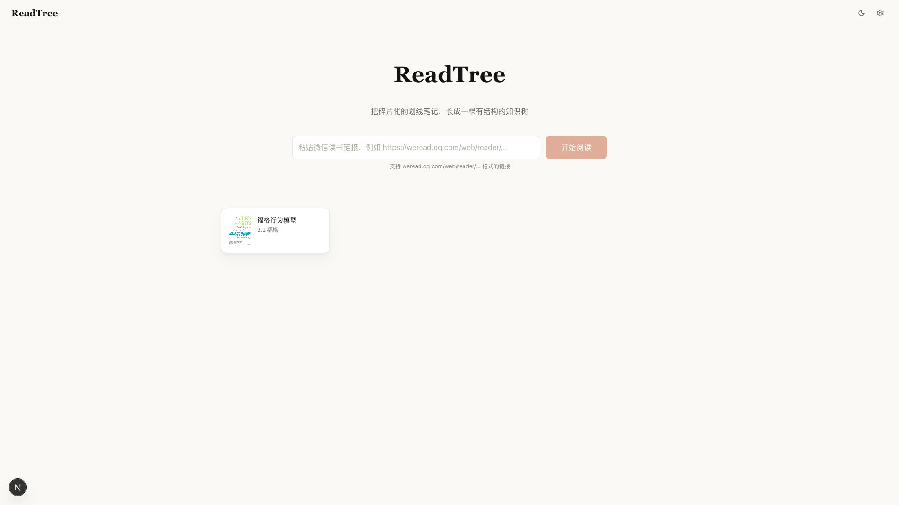
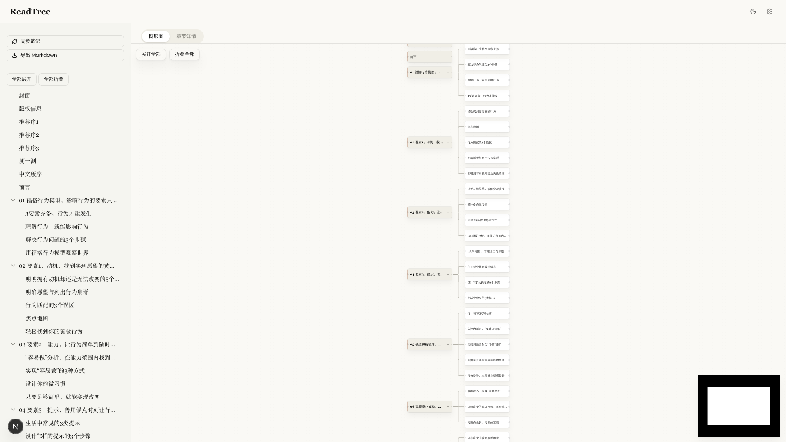
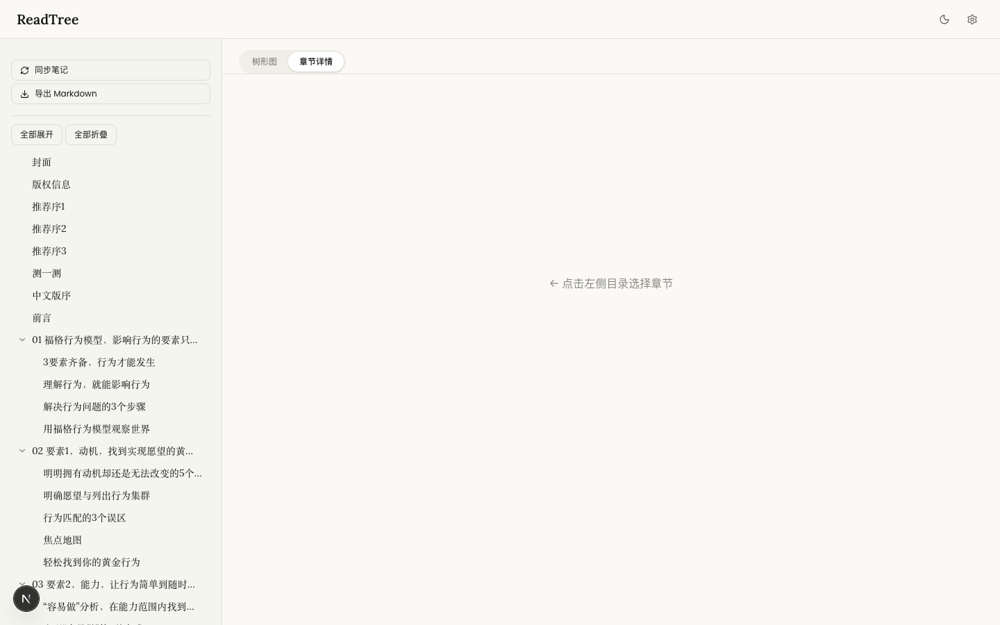
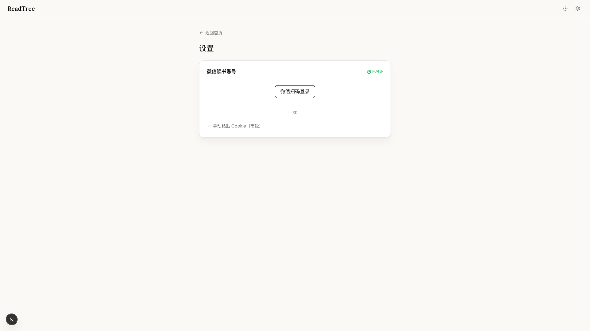
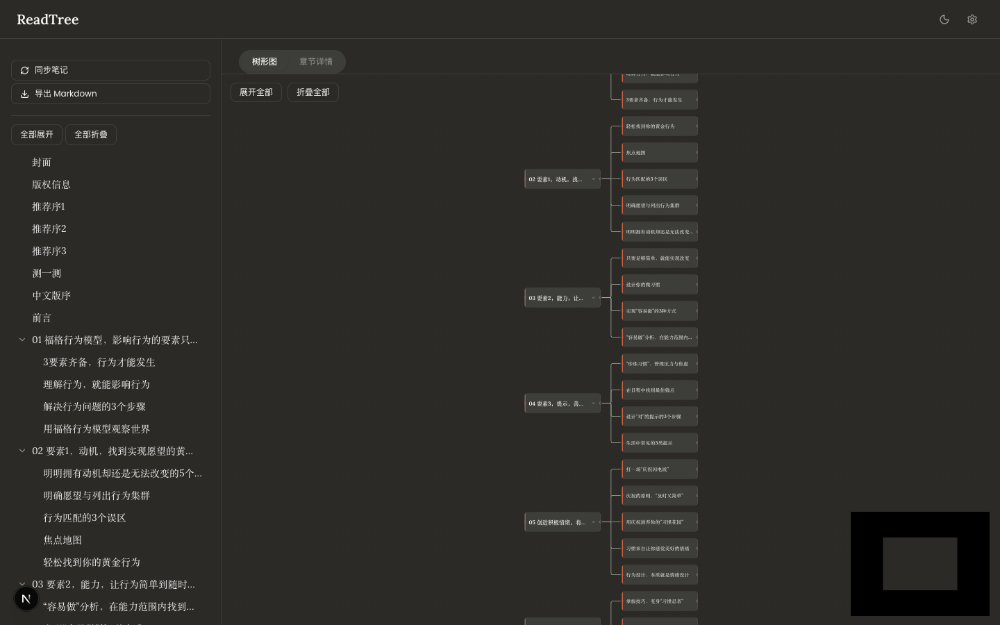

# ReadTree

> 把微信读书的碎片化划线笔记，长成一棵有结构的知识树

<p align="center">
  
</p>

---

## 为什么做这个？

微信读书的划线功能太顺手了——读到好句子，随手一划，继续往下看。但问题是，**划了就忘**。等你想回头复习，几十条碎片化的划线堆在一起，根本不知道哪条对应哪个章节，更别说理清脉络了。

笔记碎片化是个普遍痛点：你记下了"什么"，却丢失了"为什么"和"在哪个上下文里"。单条金句很美，但没有结构，就像散落一地的拼图，拼不出全貌。

ReadTree 的想法很简单：**以书籍目录为骨架，把你的划线和笔记挂到对应章节上**，自动长成一棵知识树。每次打开，你看到的不是一堆碎片，而是一本被你读透的书。

---

## 功能亮点

- 📖 **粘贴链接，自动抓取** — 贴入微信读书书籍链接，自动解析书名、封面和完整目录
- 🌳 **可视化知识树** — 用 React Flow 渲染树形图，章节层级一目了然，支持拖拽和缩放
- ✏️ **章节笔记** — 给每个章节写总结，记录你的理解和思考
- 📌 **自动同步划线** — 一键拉取微信读书的划线和批注，自动挂载到对应章节
- 🔍 **手动添加句子** — 遇到好句子，手动添加精彩引用，随时补充
- 📤 **一键导出 Markdown** — 整本书的笔记结构化导出，方便归档或导入 Obsidian / Notion
- 🌙 **暗色模式** — 保护你的眼睛，深夜读书也舒适
- 📱 **微信扫码登录** — 扫码即登录，无需手动复制 Cookie，省心省力

---

## 截图预览

<p align="center">
  
  <br/>
  <em>树形图视图 — 章节层级清晰，点击节点可查看笔记</em>
</p>

<p align="center">
  
  <br/>
  <em>章节详情 — 划线、批注、个人总结集中展示</em>
</p>

<p align="center">
  
  <br/>
  <em>设置页 — 扫码登录微信读书，授权一次即可</em>
</p>

<p align="center">
  
  <br/>
  <em>暗色模式 — 夜间阅读更护眼</em>
</p>

---

## 快速开始

### 1. 克隆项目

```bash
git clone https://github.com/syfssb/readtree.git
cd readtree
```

### 2. 安装依赖

```bash
npm install
```

### 3. 初始化数据库

```bash
npm run db:migrate
```

### 4. 启动开发服务器

```bash
npm run dev
```

### 5. 打开浏览器

访问 [http://localhost:3000](http://localhost:3000)，开始使用。

---

## 使用方法

1. **扫码登录** — 打开设置页，用微信扫码完成微信读书授权（只需一次）
2. **添加书籍** — 回到首页，粘贴微信读书书籍链接，点击添加
3. **查看知识树** — 进入书籍页，目录会自动解析成可视化树形图
4. **同步划线** — 点击「同步笔记」按钮，划线和批注自动拉取并挂载到章节
5. **写章节总结** — 点击任意章节节点，为该章节添加你自己的总结和思考
6. **导出笔记** — 点击导出按钮，整本书的结构化笔记以 Markdown 格式下载

---

## 技术栈

| 分类 | 技术 |
|------|------|
| 前端框架 | Next.js 16 + React 19 |
| 样式 | Tailwind CSS 4 |
| 可视化 | React Flow (@xyflow/react) |
| 数据库 | SQLite + Drizzle ORM |
| 主题 | next-themes（支持暗色模式） |
| 表单校验 | Zod |
| 测试 | Vitest |

---

## 项目结构

```
src/
├── app/                  # Next.js App Router 页面和 API 路由
│   ├── page.tsx          # 首页（书架）
│   ├── book/[bookId]/    # 书籍详情页（树形图）
│   ├── settings/         # 设置页（登录 & 配置）
│   └── api/              # 后端 API 路由
│       ├── auth/         # 微信扫码登录
│       ├── books/        # 书籍 CRUD
│       └── books/[bookId]/
│           ├── sync/     # 同步划线
│           ├── export/   # 导出 Markdown
│           └── chapters/ # 章节笔记管理
├── components/           # UI 组件
│   ├── tree/             # 树形图相关组件
│   ├── chapter/          # 章节详情组件
│   ├── book/             # 书架和书籍卡片
│   └── settings/         # 设置页组件
├── repositories/         # 数据访问层（Repository 模式）
├── lib/                  # 工具函数和微信读书 API 封装
└── types/                # TypeScript 类型定义
```

---

## 部署

### Vercel（推荐）

1. Fork 本项目到你的 GitHub
2. 在 [Vercel](https://vercel.com) 导入该仓库
3. 一键部署，完成

> **注意：** Vercel 免费版使用无状态文件系统，SQLite 数据每次冷启动后会重置。建议搭配持久化存储使用，或换用 Zeabur 等支持本地持久卷的平台。

### Zeabur

1. 在 [Zeabur](https://zeabur.com) 创建新项目
2. 导入 GitHub 仓库
3. 挂载持久化存储卷到 `/data` 目录（用于存放 SQLite 数据文件）
4. 部署完成

---

## License

[MIT](./LICENSE)
